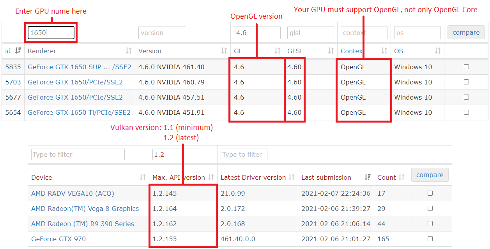

## Table of Contents

* [**Introduction**](/quickstart/)
	- [Hardware Requirements](#hardware-requirements)
	- [Downloading & Installing yuzu](/quickstart/downloading/)
* [Prerequisites](/quickstart/prerequisites/)
* [Preparing the microSD Card](/quickstart/prepare-sd-card/)
* [Booting into RCM](/quickstart/boot-to-rcm/)
* [Booting into Hekate](/quickstart/boot-to-hekate/)
* [Dumping Decryption Keys](/quickstart/dump-keys/)
* [Backing up Switch NAND](/quickstart/nand-backup/)
* [Dumping System Update Firmware](/quickstart/dump-firmware/)
* [Dumping Games](/quickstart/dump-games/)
* [Dumping Save Files](/quickstart/dump-saves/)
* [Rebooting the Switch Back to its Original State](/quickstart/reboot-to-stock/)
* [Running yuzu](/quickstart/running-yuzu/)
* [Mounting the microSD card to your computer in Hekate](/quickstart/hekate-ums/)

Welcome to the Quickstart Guide!

To start playing commercial games, yuzu needs a couple of system files and folders from your switch in order to play them properly.
This guide will help you copy all your system files, games, updates, and DLC from your switch to your computer and organize them in a format yuzu understands. 

This process should take about 60 to 90 minutes.

To check if your Switch is hackable, visit <https://damota.me/ssnc/checker> and test your Switch's serial number.

<article class="message has-text-weight-semibold is-warning">
  

    
Warning!

  

  

	<li>If your Switch is patched, you will not be able to complete rest of this guide.</li>
	 
    <li>The 2019 Switch revision (Mariko/Red Box/HAC-001(-01)) and the Switch Lite are both patched and you will not be able to complete rest of this guide.</li>
  

</article>

But first, we must determine whether your computer meets the following hardware requirements for running yuzu.

## Hardware Requirements

Our recommended specifications don't guarantee perfect performance in most games, but rather strive to provide a cost effective recommendation while still considering performance.

 

| Component 	| Minimum                                                                               			| Recommended                                                                                  			|
|-----------	|---------------------------------------------------------------------------------------			|----------------------------------------------------------------------------------------------			|
| CPU       	| Intel Core i5-4430   or  AMD Ryzen 3 1200                                           		| Intel Core i5-10400   or  AMD Ryzen 5 3600                                                 		|
| GPU       	| Intel HD Graphics 520   or  NVIDIA GeForce GT 1030 2GB  or  AMD Radeon R7 240 2GB 	| Intel UHD Graphics 630   or  NVIDIA GeForce GTX 1650 4GB   or  AMD Radeon RX Vega 56 8GB 	|
| RAM       	| 8 GB                                                                                  			| 16 GB                                                                                        			|

 
<article class="message is-link">
  

    
Check your GPU Compatibility

  

  

	<b>GPUs must support OpenGL 4.6 & OpenGL Compatibility profile, or Vulkan 1.1 (or higher).</b>  
	

	To find out if your GPU meets these requirements, visit https://opengl.gpuinfo.org or 
	https://vulkan.gpuinfo.org/ and check your GPU details.
	  
	<b>Sample Image:</b>
	

		
  

</article>
 
<article class="message is-primary">
  

    
Note

  

  

	<li>Most games are playable on older Nvidia GPUs from the Fermi family (400 series) or later, but at least Pascal (1000 series) is strongly recommended.</li>
	 
	<li>CPUs lacking the FMA instruction set will produce very poor results. Intel Core gen 3 series or older, AMD phenom II or older and all Pentium/Celeron/Atom CPUs will not produce optimal results.</li>
	 
	<li>Laptop CPUs will not reach the same performance as their desktop counterparts due to thermal, power, and technical limitations.</li>
  

</article>

[Continue 2 Step 1](/quickstart/downloading/)