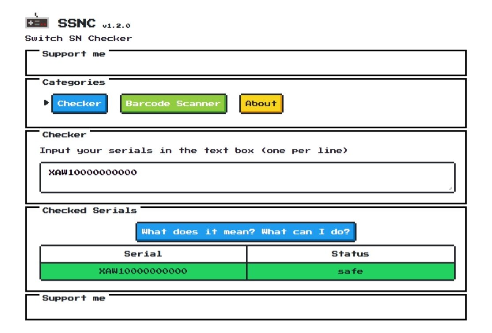
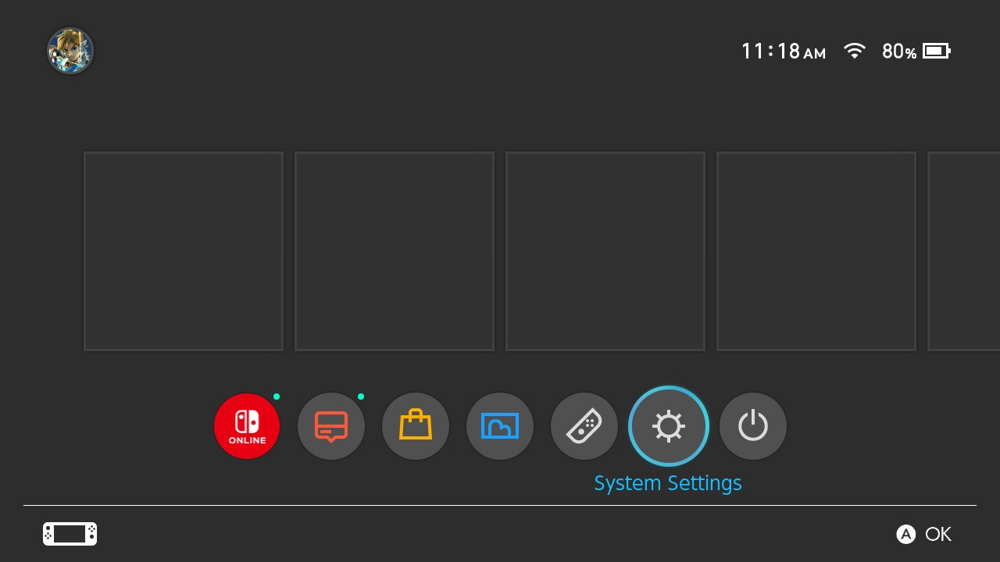
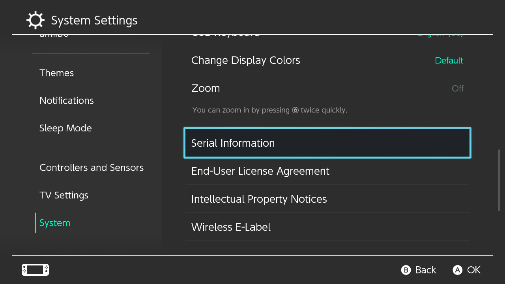
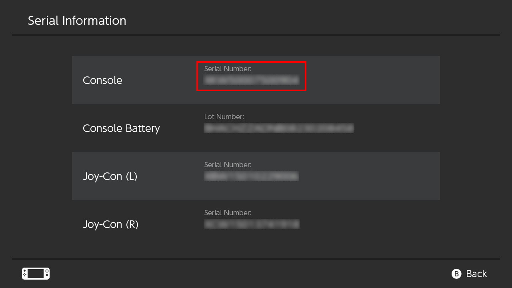

## Table of Contents

* [Introduction](/quickstart/)
* [**Prerequisites**](/quickstart/prerequisites/)
* [Preparing the microSD Card](/quickstart/prepare-sd-card/)
* [Booting into RCM](/quickstart/boot-to-rcm/)
* [Booting into Hekate](/quickstart/boot-to-hekate/)
* [Dumping Decryption Keys](/quickstart/dump-keys/)
* [Backing up Switch NAND](/quickstart/nand-backup/)
* [Dumping System Update Firmware](/quickstart/dump-firmware/)
* [Dumping Games](/quickstart/dump-games/)
* [Dumping Save Files](/quickstart/dump-saves/)
* [Rebooting the Switch Back to its Original State](/quickstart/reboot-to-stock/)
* [Running yuzu](/quickstart/running-yuzu/)
* [Mounting the microSD card to your computer in Hekate](/quickstart/hekate-ums/)

## Prerequisites

* A Nintendo Switch vulnerable to the fusée gelée RCM exploit -- Visit <https://damota.me/ssnc/checker> and test your Switch's serial number

    

    You can find the serial number at the bottom of your console, on the left side of the USB-C port:

    

    Alternatively, it can be also found inside the system by opening the `System Settings` app and heading to `System > Serial Information`:

    
    
    

    **NOTE:** The 2019 Switch revision (HAC-001(-01)/Red box) and the Switch Lite units contain serial numbers that start with the `XKW`, `XKJ`, `XJW` or `XWW` prefix. Despite SSNC marking the status of such serial numbers as `warning`, they are **definitely patched** out of the fusée gelée RCM exploit, as those models are powered by a revision of the Tegra X1 processor (codenamed Mariko).

    

* A microSD card with at least 30 GB of free space (an almost empty 32GB microSD card will work). 64 GB or more recommended.
* A USB-C to USB-A or USB-C to USB-C Cable to connect your Switch to your computer
* [TegraRcmGUI](https://github.com/eliboa/TegraRcmGUI/releases/latest) -- Download `TegraRcmGUI_v2.6_Installer.msi`
* [Hekate](https://github.com/CTCaer/hekate/releases/latest) -- Download `hekate_ctcaer_X.X.X_Nyx_X.X.X.zip`

    (Windows users: download `nyx_usb_max_rate__run_only_once_per_windows_pc.reg` too)
* [Atmosphere](https://github.com/Atmosphere-NX/Atmosphere/releases/latest) -- Download both `atmosphere-X.X.X-master-XXXXXXXX+hbl-X.X.X+hbmenu-X.X.X.zip` and `fusee-primary.bin`
* [Lockpick_RCM](https://github.com/shchmue/Lockpick_RCM/releases/latest) -- Download `Lockpick_RCM.bin`
* [nxdumptool](https://github.com/DarkMatterCore/nxdumptool/releases/latest) -- Download `nxdumptool.nro`
* [nxDumpMerger](https://github.com/emiyl/nxDumpMerger/releases/tag/v0.3.4) -- Download `nxDumpMerger_Windows.zip`
* [TegraExplorer](https://github.com/suchmememanyskill/TegraExplorer/releases/latest) -- Download `TegraExplorer.bin`
* [microSD Card Reader](https://www.amazon.com/dp/B006T9B6R2) -- If your computer has one built-in, you can use that
* [RCM Jig](https://www.amazon.com/dp/B07J9JJRRG) <-- We highly recommend one like this, but you could use any of the methods outlined [here](https://noirscape.github.io/RCM-Guide/)

`%YUZU_DIR%` is the home directory for yuzu on your computer:

    - For Windows, this is '%APPDATA%\yuzu' or 'C:\Users\{username}\AppData\Roaming\yuzu'
    - For Linux, this is '~/.local/share/yuzu'
